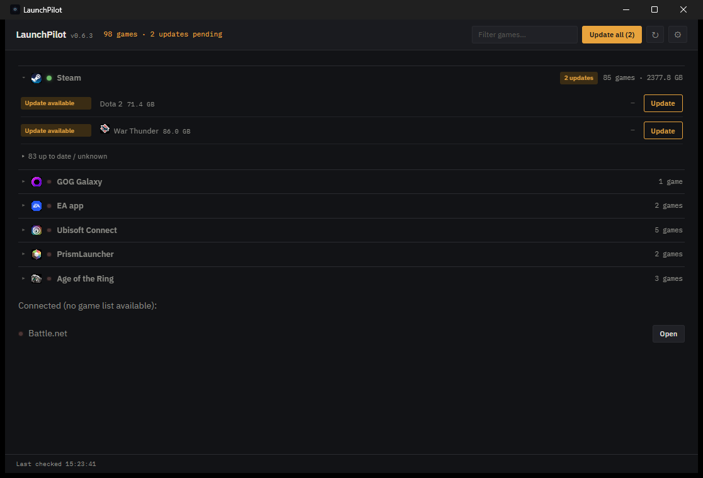

<div align="center">


# LaunchPilot

**One dashboard for every game launcher on your PC.**

See what needs updating across Steam, Epic, GOG, EA, Ubisoft Connect, Battle.net, Riot, PrismLauncher, Wargaming Game Center, and Age of the Ring — and trigger updates without opening ten different apps.

[](https://github.com/vxkShelby/Launch-Pilot/releases/latest)
[](https://github.com/vxkShelby/Launch-Pilot/actions/workflows/release.yml)




</div>

## Why

Every launcher has its own "check for updates" button, buried in its own window. LaunchPilot reads
what each launcher already knows locally — no accounts, no passwords, no scraping — and puts it in
one dense, dark dashboard. Nothing here is invented: if a launcher doesn't expose a real way to know
whether an update is pending, LaunchPilot says **Unknown** instead of guessing.

## What's real, per launcher

| Launcher | Detect | Game list | Update status | Trigger |
|---|:---:|:---:|:---:|---|
| **Steam** | ✅ | ✅ | ✅ (`StateFlags` + buildid) | `steam://validate/<appid>` |
| **Epic Games** | ✅ | ✅ | — *(no local field exists)* | `com.epicgames.launcher://apps/<id>` |
| **GOG Galaxy** | ✅ | ✅ | ✅ live (`content-system.gog.com`, no login) | `goggalaxy://openGameView/<id>` |
| **Riot Client** | ✅ | ✅ (light) | — *(no local field exists)* | launches `RiotClientServices.exe` |
| **EA app** | ✅ | ✅ (registry) | ✅ live "Updating" (`.tmp` staging files) | `origin2://` (opens client) |
| **PrismLauncher** | ✅ | ✅ | ✅ live (Mojang's public version manifest, no login) | launches `prismlauncher.exe` |
| **Ubisoft Connect** | ✅ | ✅ (registry + Steam cross-detect) | — *(no local field exists)* | `uplay://` (opens client) |
| **Battle.net** | ✅ | ✅ (registry, known-product table) | ✅ live "Updating" (log-based) | `battlenet://` (opens client) |
| **Wargaming Game Center** | ✅ | ✅ (`preferences.xml`) | ✅ (`game_info.xml` installed vs. available) | scans for `wgc.exe` (heuristic) |
| **Age of the Ring** | ⚠️ heuristic (drive scan, no installer footprint) | ✅ (mod + 2 base games) | — *(no local field exists)* | launches `AotR_Launcher.exe` |

Steam is the reference implementation — full local visibility into what's installed, what build it's
on, and whether Valve has a newer one queued. The others get exactly as much automation as their
local data honestly supports; the rest is one click into the real launcher.

Every launcher and game also shows its real local icon (pulled from Windows' own icon cache for
that launcher's client exe, or that specific game's own exe/registry-declared icon) — never a
bundled or guessed image.

## Dev

```bash
npm install
npm run tauri dev
```

Rust unit tests (VDF/KeyValues parser):

```bash
cd src-tauri && cargo test
```

## Self-update signing (CI secrets)

Updates are signed with a minisign keypair generated via `npx tauri signer generate`. The public
key lives in `src-tauri/tauri.conf.json` (`plugins.updater.pubkey`). The private key must **never**
be committed — it's gitignored (`src-tauri/*.key`).

To wire up CI signing, add two repo secrets (Settings → Secrets and variables → Actions):

- `TAURI_SIGNING_PRIVATE_KEY` — contents of `src-tauri/launchpilot-updater.key`
- `TAURI_SIGNING_PRIVATE_KEY_PASSWORD` — the password used when generating the key

Losing either means you can no longer publish updates users' existing installs will trust — back
both up somewhere durable (password manager) outside this repo.

## Releasing

Push a tag matching `v*` (e.g. `v0.2.0`) or run the `release` workflow manually. `tauri-action`
builds the signed Windows installer + `latest.json` and attaches them to a draft GitHub Release —
review and publish it. The app checks
`https://github.com/vxkShelby/Launch-Pilot/releases/latest/download/latest.json` on startup and on
its configurable auto-refresh timer.
